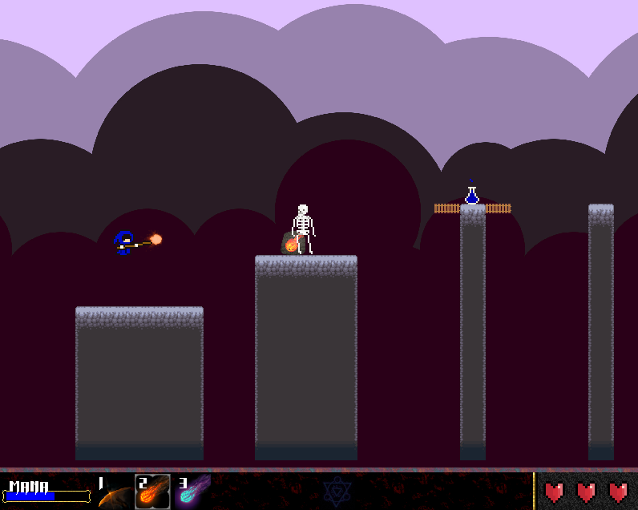

# Orbs And Wizards

C++ based game using SDL2 library for graphics and input handling

Modern port. Originally done in 2015/2016

## Credits

Font: Return To Castle (https://www.dafont.com/return-to-castle.font)

Artwork: https://opengameart.org (and a couple of other sources)




## Building

First make sure that all submodules are cloned

```
git submodule update --init --recursive
```

Then build
```
cmake -S . -B build
cmake --build build --config Debug --parallel
```

To run using development resources
```
# Linux/macOS
./build/OrbsAndWizards
# Windows
./build/Debug/OrbsAndWizards.exe
```

## Package

To create a package to release/share, build first and then install with below command
```
cmake --build build --config Release --target install
```

Resulting game can be found in `build/install/OrbsAndWizards` folder

### Manylinux

To build for many linux platforms, use the following command:

```
docker run -it --rm -v $PWD:/work -w /work quay.io/pypa/manylinux2014_x86_64 bash
# In container - install freetype dependency
yum -y install freetype*
cmake -S . -B build_manylinux2014 -D CMAKE_BUILD_TYPE=Release -D CMAKE_INSTALL_PREFIX=$PWD/build_manylinux2014/install
cmake --build build_manylinux2014/ --config Release --target install
# Modify files back to "default" user
chown 1000:1000 -R build_manylinux2014/
# Exit the container
exit
```
